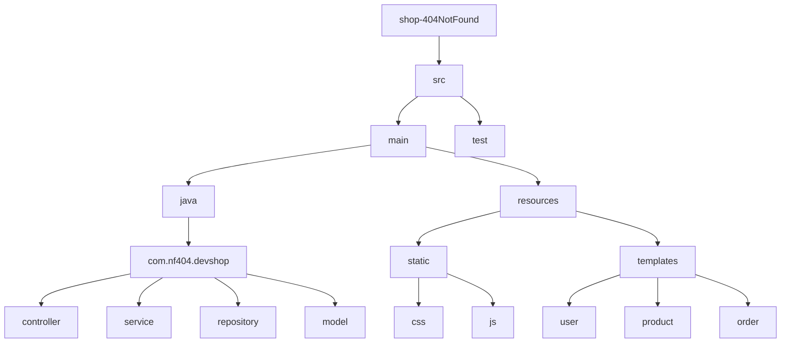

# 🛒 shop-404NotFound 관리자 시스템

개발자들을 위한 전문 쇼핑몰 'shop-404NotFound'의 관리자 시스템입니다. 이 시스템을 통해 상품, 주문, 회원 등을 효율적으로 관리할 수 있습니다.

## 🚀 프로젝트 개요

이 프로젝트는 개발자 전문 쇼핑몰의 백엔드 관리 시스템으로, 다음과 같은 특징을 가지고 있습니다:

- 📦 상품 관리 (등록, 수정, 삭제, 재고 관리)
- 🛍️ 주문 관리 및 처리
- 👥 회원 관리
- *수정바람

## 👨‍👩‍👧‍👦 팀원 소개 및 담당 역할

- 👩‍💼 고유진: 주문 관리 도메인 개발 및 디자인
- 👨‍🎨 김동휘: 프론트엔드 개발, UI/UX 디자인 (*수정해주세여)
- 👨‍💻 안준렬: 데이터베이스 설계 및 관리 (*수정해주세여)
- 🧑‍💻 좌상현: 백엔드 개발, API 설계 (*수정해주세여)
- 👨‍🔧 추형진: 회원 관리 기능 개발

## 🔑 주요 기능

- 🗂️ 상품 카테고리 및 상품 정보 관리
- 📊 주문 관리, 상태 추적 및 업데이트
- 🔍 회원 정보 조회 및 관리
- 📝 시스템 로그 모니터링
- *수정바람

## 🛠️ 기술 스택

- 🔙 백엔드: Spring Boot, Java
- 🖥️ 프론트엔드: Thymeleaf, JavaScript, Bootstrap
- 💾 데이터베이스: MySQL
- 🔗 ORM: MyBatis
- 🏗️ 빌드 도구: Gradle

## 📁 프로젝트 구조


```markdown
주요 디렉토리 설명:
- `controller`: MVC 패턴의 컨트롤러 클래스들이 위치
- `service`: 비즈니스 로직을 처리하는 서비스 클래스들이 위치
- `repository`: 데이터베이스 연동을 담당하는 레포지토리 클래스들이 위치
- `model`: 데이터 모델 클래스들이 위치
- `static`: CSS, JavaScript 등 정적 파일들이 위치
- `templates`: Thymeleaf 템플릿 파일들이 위치
```

## 📥 설치 및 실행 방법

1. 저장소 클론
git clone https://github.com/ssg-240304-java2/shop-404NotFound.git

2. 데이터베이스 설정
- MySQL에서 새 데이터베이스 생성
- `src/main/resources/application.yml` 파일에서 데이터베이스 연결 정보 수정

3. 프로젝트 빌드 및 실행
- ./gradlew bootRun

4. 또는 웹 브라우저에서 `http://dokalab.asuscomm.com:28080/` 접속

## 📝 회고록
- 추형진 : 수업을 들으며 늘 해왔던 백엔드의 코드가 실제로 눈앞에서 작동이 되게 하고, 작동을 확인하는 것을 보니 왠지모를 뿌듯함이 느껴졌던 프로젝트였습니다. 하지만 처음 접하고 개발해보는 프론트 부분에서 생각보다 백엔드와의 연동을 위하여 많은 시간을 썻었던 것 같습니다. 주 원인들은 백엔드와 프론트의 잘 못 설정된 연결들이 주 원인이였던 것 같습니다.
이번 프로젝트를 하면서 제일 많이 느꼇던 점은 팀원들의 각각의 장점을 알고, 그 파트를 나눌 수 있게 해야 겠다라는 점을 많이 느끼게 되었습니다.

- 김동휘 : 프로젝트에 있어 다같이 꾸준한 대화를 통해 이끌어 낸 합의를 통해 적절한 결과를 이끌어 낼 수 있었다고 생각합니다. 서버사이드렌더링을 통해 동적으로 페이지를 렌더링하여 볼 수 있다는 점이 인상적이었습니다. 앞으로 조금 더 기능적, 기술적인 고도화를 접하게 된다면 조금 더 세밀한 계획을 가꾸어 프로젝트를 수행해도 좋을 것 같다는 생각이 듭니다.

- 안준렬
    
    웹페이지를 직접 구현해보니 신경써야할게 되게 많았다. 처음이다보니 미숙했는데 이번경험으로 웹페이지구현 흐름에대해
    알게 되었고,
    Git Flow 형상관리에 대해서 직접 실천해보고 경험할 수 있어서 조금은 익숙해진것 같다.
    
    프로젝트기간이 짧다보니 구현하고 싶은 기능들을 전부다 구현하지 못해서 아쉬웠다.  개발을 해보면서 발견했던 단점들을 줄여나가서 다음프로젝트떄는 목표한 기능들을 구현해내고싶다.
- 고유진: github Desktop을 사용하면서 브랜치 관리 툴을 알게 되어서 좋았고 많은 회의와 빠른 피드백으로 코드를 짤때 헤매지 않을 수 있었습니다. 아쉬운 거는 제 도메인 UI를 좀 더 개선하고 싶고 더 현실적인 로직을 짜고 싶습니다.
- 좌상현 : 처음으로 백 로직 부분과 프론트 부분을 구현해 봐서 좋은 경험이 되었다. 또 전 프로젝트에서 미흡했던 Git Flow부분도 많이 보완이 된 느낌이다.<br> 이번 계기로 frontend 담당자와 backend 담당자의 커뮤니케이션이 굉장히 중요하다고 느껴졌고, 사용자에게 더 나은 프로젝트를 제공하기 위해 많은 것을 고려해야 된다고 느끼게 되었다.<br> 아쉬웠던 부분은 내 테스크를 목표 기한까지 못한 일들이 있어서 프로젝트 일정에 딜레이가 생기게 된 것 같다.<br>다음부터는 더 세밀한 계획을 새워서 관리해야 할 것 같다.
