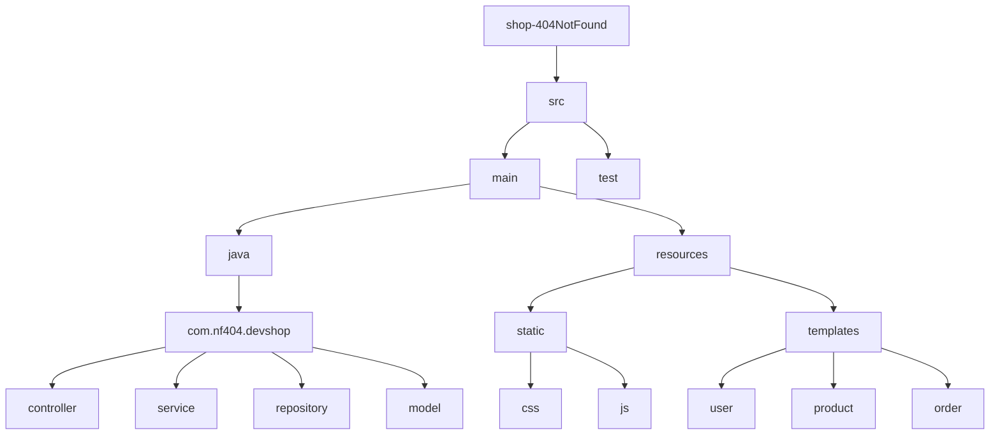

# 🛒 shop-404NotFound 관리자 시스템

개발자들을 위한 전문 쇼핑몰 'shop-404NotFound'의 관리자 시스템입니다. 이 시스템을 통해 상품, 주문, 회원 등을 효율적으로 관리할 수 있습니다.

## 🚀 프로젝트 개요

이 프로젝트는 개발자 전문 쇼핑몰의 백엔드 관리 시스템으로, 다음과 같은 특징을 가지고 있습니다:

- 📦 상품 관리 (등록, 수정, 삭제, 재고 관리)
- 🛍️ 주문 관리 및 처리
- 👥 회원 관리
- *수정바람

## 👨‍👩‍👧‍👦 팀원 소개 및 담당 역할

- 👩‍💼 고유진: 프로젝트 리더, 백엔드 개발 (*수정해주세여)
- 👨‍🎨 김동휘: 프론트엔드 개발, UI/UX 디자인 (*수정해주세여)
- 👨‍💻 안준렬: 데이터베이스 설계 및 관리 (*수정해주세여)
- 🧑‍💻 좌상현: 백엔드 개발, API 설계 (*수정해주세여)
- 👨‍🔧 추형진: 회원 관리 기능 개발

## 🔑 주요 기능

- 🗂️ 상품 카테고리 및 상품 정보 관리
- 📊 주문 관리, 상태 추적 및 업데이트
- 🔍 회원 정보 조회 및 관리
- 📝 시스템 로그 모니터링
- *수정바람

## 🛠️ 기술 스택

- 🔙 백엔드: Spring Boot, Java
- 🖥️ 프론트엔드: Thymeleaf, JavaScript, Bootstrap
- 💾 데이터베이스: MySQL
- 🔗 ORM: MyBatis
- 🏗️ 빌드 도구: Gradle

## 📁 프로젝트 구조


```markdown
주요 디렉토리 설명:
- `controller`: MVC 패턴의 컨트롤러 클래스들이 위치
- `service`: 비즈니스 로직을 처리하는 서비스 클래스들이 위치
- `repository`: 데이터베이스 연동을 담당하는 레포지토리 클래스들이 위치
- `model`: 데이터 모델 클래스들이 위치
- `static`: CSS, JavaScript 등 정적 파일들이 위치
- `templates`: Thymeleaf 템플릿 파일들이 위치
```

## 📥 설치 및 실행 방법

1. 저장소 클론
git clone https://github.com/ssg-240304-java2/shop-404NotFound.git

2. 데이터베이스 설정
- MySQL에서 새 데이터베이스 생성
- `src/main/resources/application.yml` 파일에서 데이터베이스 연결 정보 수정

3. 프로젝트 빌드 및 실행
- ./gradlew bootRun

4. 또는 웹 브라우저에서 `http://dokalab.asuscomm.com:28080/` 접속

## 📝 회고록

회고록 작성해주세요~
